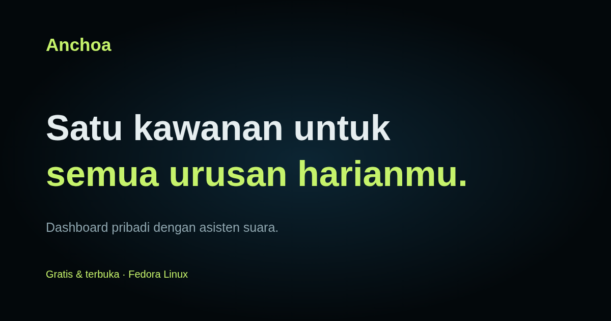
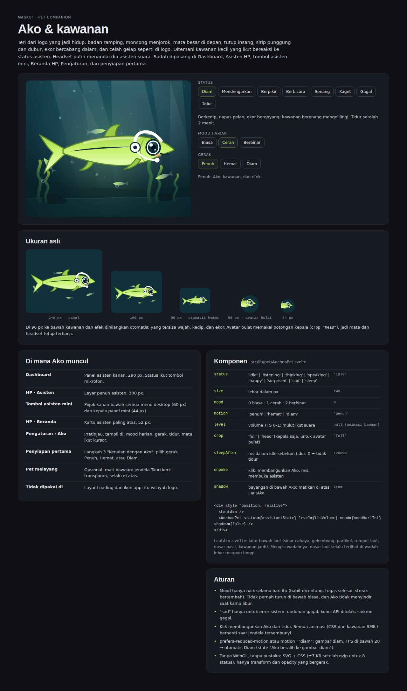
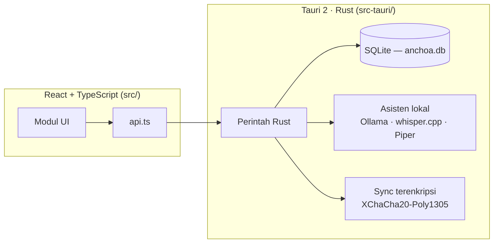

<p align="center">
  
</p>

<h1 align="center">Anchoa</h1>

<p align="center">
  Aplikasi desktop all-in-one untuk urusan harian: tugas, jadwal, keuangan, jurnal, catatan, berkas, unduhan, dan email — dalam satu tempat, dengan asisten AI yang berjalan di laptopmu sendiri.
</p>

<p align="center">
  <a href="https://github.com/Syharipf/Anchoa/releases/latest"></a>
  <a href="https://github.com/Syharipf/Anchoa/actions/workflows/ci.yml"></a>
  
</p>

<p align="center">
  <a href="https://syharipf.github.io/Anchoa/">Landing page</a> ·
  <a href="docs/MANUAL.md">Panduan pengguna</a> ·
  <a href="#instalasi">Instalasi</a> ·
  <a href="https://github.com/Syharipf/Anchoa/releases">Rilis</a>
</p>

---

Anchoa adalah aplikasi desktop [Tauri](https://v2.tauri.app/) untuk Fedora Linux yang menggabungkan manajemen tugas, kalender, keuangan, jurnal, catatan, berkas, unduhan, dan email dalam satu antarmuka. Semua data disimpan secara lokal di satu basis data SQLite, sehingga aplikasi tetap berfungsi penuh tanpa koneksi internet maupun akun cloud. Asisten AI-nya berjalan di [Ollama](https://ollama.com/) di mesin yang sama, sehingga percakapan dan pemrosesan dokumen tidak meninggalkan perangkat. Sinkronisasi antarperangkat tersedia sebagai opsi dan selalu terenkripsi ujung-ke-ujung.

## Fitur utama

- **Semua modul saling tertaut.** Tugas, agenda, tagihan, habit, jurnal, dan catatan saling terhubung; satu pencarian (Ctrl+K) menemukan semuanya.
- **Asisten AI lokal.** Chat berbasis Ollama di laptop; setiap aksi yang diusulkan asisten harus kamu setujui sebelum dijalankan. Model dapat dipilih per tugas.
- **Ako, maskot asisten.** Hewan laut animasi di panggung asisten (`src/pet/`), bereaksi saat mendengarkan, berpikir, dan berbicara.
- **Asisten suara.** Ucapan ke teks dengan whisper.cpp, suara keluar dengan Piper (termasuk suara Bahasa Indonesia), lewat PipeWire.
- **Unduhan lengkap.** File langsung serta video/audio lewat yt-dlp dan ffmpeg, dengan antrean; ekstensi browser mengirim tautan ke aplikasi.
- **Email Gmail.** Satu akun Gmail via App Password; ringkasan dan saran balasan dari asisten berjalan lokal.
- **Kunci PIN dan backup otomatis.** PIN di-hash dengan Argon2id dan divalidasi di sisi Rust; backup database harian disimpan otomatis.
- **Sinkronisasi terenkripsi (opsional).** Data tersinkron antarperangkat melalui Supabase dengan enkripsi XChaCha20-Poly1305; tanpa sync, tidak ada data yang keluar.
- **Baki sistem (Tray).** Tetap berjalan di latar belakang saat jendela ditutup sehingga pengingat notifikasi, sinkronisasi, dan antrean unduhan terus bekerja. Klik menu Keluar di baki sistem untuk keluar sepenuhnya.

## Modul

| Modul | Isi |
|---|---|
| Dashboard | Tugas hari ini, agenda mendatang, ringkasan modul, kontribusi GitHub (opsional) |
| Jurnal | Ide, curhat, catatan singkat, tag, suasana hati; ide bisa dijadikan tugas |
| Catatan | Halaman bertingkat, editor blok Markdown, `[[wikilink]]` dan tautan balik, sampah, ekspor Markdown |
| Email | Satu akun Gmail: baca, tulis, balas, bintang, arsip, ringkasan dan saran balasan dari asisten |
| Jadwal | Kalender bulanan dan timeline 8 minggu dari tugas, tagihan, dan Google Kalender (hanya baca) |
| Habit | Centang harian, hari aktif, pengingat, streak, riwayat |
| Keuangan | Akun, pemasukan, pengeluaran, transfer, tagihan, batas pengeluaran bulanan |
| Proyek | Kanban, sub-tugas, papan agen kode dengan utas aktivitas |
| Berkas | Jelajah folder lokal, pratinjau, salin, pindah, buang ke Tong Sampah |
| Unduhan | File langsung serta video/audio lewat yt-dlp dan ffmpeg, dengan antrean |
| Asisten | Chat dan suara, usulan aksi yang harus disetujui, model per tugas |
| Notifikasi, Profil, Pengaturan | Pengingat, statistik, kunci PIN, model AI, suara, backup, baki sistem, integrasi, sinkronisasi |

Cara memakai setiap modul ada di [panduan pengguna](docs/MANUAL.md).

## Instalasi

### Fedora (repo dnf)

Tambahkan repo Anchoa sekali, lalu pasang:

```bash
sudo dnf config-manager addrepo --from-repofile=https://syharipf.github.io/Anchoa/anchoa.repo
sudo dnf install anchoa
```

Pembaruan lewat `sudo dnf upgrade`. Paket dan metadata repo ditandatangani GPG; dnf meminta konfirmasi kunci saat pertama kali.

File `.rpm` juga tersedia di [GitHub Releases](https://github.com/Syharipf/Anchoa/releases/latest). Pasang file yang diunduh dengan:

```bash
sudo dnf install ./Anchoa-<versi>-1.x86_64.rpm
```

### Dari kode sumber

Kebutuhan: Rust stable, [bun](https://bun.sh), dan library sistem untuk Tauri:

```bash
sudo dnf install webkit2gtk4.1-devel librsvg2-devel libappindicator-gtk3-devel libxdo-devel
```

Dari akar repo:

```bash
bun install        # pasang dependensi JS
bun tauri dev      # jalankan aplikasi dengan hot reload
```

Perintah lain yang dipakai saat pengembangan:

```bash
bun run typecheck                                  # cek TypeScript
bun run test                                       # unit test frontend (bun test, TZ=Asia/Jakarta)
bun tauri build                                    # build rilis; RPM di src-tauri/target/release/bundle/rpm/
cd src-tauri && cargo clippy --all-targets -- -D warnings   # lint backend
cd src-tauri && cargo test                         # unit test backend
```

Uji end-to-end di display virtual (memerlukan `Xvfb`, `xdotool`, ImageMagick, dan `sqlite3`):

```bash
bun tauri build --debug --no-bundle
scripts/e2e-smoke.sh src-tauri/target/debug/anchoa
```

Landing page (Astro) ada di `landing/`:

```bash
cd landing
bun install
bun run build          # termasuk astro check
bun run test:e2e       # test Playwright
```

## Memulai

1. Pasang dan buka Anchoa dari menu aplikasi, atau jalankan `anchoa`. Saat pertama dibuka, database lokal dibuat dan Dashboard tampil — tanpa perlu membuat akun Anchoa.
2. *(Opsional)* **Asisten AI.** Pasang [Ollama](https://ollama.com/), jalankan layanannya, lalu unduh model bawaan:

   ```bash
   sudo dnf install ollama
   sudo systemctl start ollama
   ollama pull qwen2.5:3b
   ```

   Buka **Pengaturan → Asisten & AI**, klik **Tes koneksi**, lalu pilih model per tugas. Alamat bawaan: `http://127.0.0.1:11434`.
3. *(Opsional)* **Suara.** Di **Pengaturan → Suara**, pasang model Whisper (ggml-base.bin) untuk ucapan ke teks, lalu **Piper TTS** dan suara **Indonesia · News** (`id_ID-news_tts-medium`) untuk membacakan jawaban. Binary dan model diunduh oleh aplikasi; perekaman dan pemutaran memakai PipeWire (`pipewire-utils`).
4. *(Opsional)* **Email Gmail.** Aktifkan 2-Step Verification, buat App Password di [akun Google](https://myaccount.google.com/apppasswords), lalu isi **Alamat Gmail** dan **App Password** di menu Email dan klik **Sambungkan**. Password 16 huruf disimpan di keyring sistem.
5. *(Opsional)* **Sinkronisasi.** Hubungkan akun Google/GitHub lewat **Pengaturan → Sinkron & data** untuk menyinkronkan data antarperangkat secara terenkripsi.

## Tangkapan layar

| | |
|---|---|
|  |  |
| Pratinjau (kartu sosial dari landing page) | Lembar desain Ako, maskot asisten (aset resmi) |

Tangkapan layar dan ilustrasi lain ada di [landing page](https://syharipf.github.io/Anchoa/).

## Arsitektur

Anchoa adalah *modular monolith*: satu proses aplikasi, satu basis data SQLite, tanpa layanan terpisah.

- **Backend:** Tauri 2 (Rust) di `src-tauri/`. Frontend tidak pernah menyentuh database; setiap aksi adalah perintah Rust, dan `src/api.ts` adalah satu-satunya pemanggil `invoke()`.
- **Frontend:** React 19 + TypeScript + Vite + Tailwind di `src/`.
- **Model data:** setiap hal adalah satu baris di tabel `items`, dengan tabel perpanjangan per modul. ID memakai UUIDv7, waktu disimpan sebagai epoch milidetik UTC, dan penghapusan bersifat *soft* (`deleted_at`) — pilihan yang membuat sinkronisasi multi-perangkat tidak butuh migrasi besar.
- **Batas hari** ("hari ini", "terlambat") dihitung di Rust, dalam waktu lokal. Uang disimpan sebagai bilangan bulat satuan terkecil, bukan float.



## Privasi & data lokal

- **Tetap di laptopmu:** seluruh data aplikasi (tugas, keuangan, jurnal, catatan, pengaturan) berada di SQLite lokal pada `~/.local/share/io.github.syharipf.anchoa/anchoa.db`, beserta backup di folder `backups/` di direktori yang sama.
- **Backup:** dibuat otomatis saat aplikasi dibuka (maksimal satu per hari), dengan rotasi 7 berkas terbaru bersama backup manual. Backup hanya menyalin database SQLite — berkas asli, hasil unduhan, dan model suara tidak ikut.
- **Kredensial:** PIN di-hash dengan Argon2id dan diverifikasi di sisi Rust; App Password Gmail disimpan di keyring sistem, bukan di database.
- **Yang keluar:** email dan unduhan tentu berkomunikasi dengan sumbernya masing-masing (Gmail, situs tujuan). Model dan suara asisten diunduh sekali saat dipasang; setelah itu percakapan dan pemrosesan suara berjalan sepenuhnya lokal.
- **Sinkronisasi bersifat opsional** dan terenkripsi ujung-ke-ujung (XChaCha20-Poly1305) sebelum data dikirim ke Supabase.
- **Batasan:** database dan backup belum dienkripsi saat disimpan di disk; enkripsi at-rest direncanakan untuk fase berikutnya.

## Roadmap

Pengembangan berjalan per fase; setiap fase punya spec di [`docs/superpowers/specs/`](docs/superpowers/specs/) dan rencana implementasi per PR di [`docs/superpowers/plans/`](docs/superpowers/plans/), dengan isu GitHub yang dikelompokkan dalam milestone. Status saat ini: tersedia untuk Fedora Linux; build Windows dan Android direncanakan pada Fase 9. Fitur yang tersedia mengikuti kode, bukan rencana.

## Kontribusi

Tidak ada `CONTRIBUTING.md` di repo ini; alur kerjanya sebagai berikut:

1. Buat cabang `feat/<nomor-isu>-<slug>` dari `main`. `main` adalah branch terlindungi — semua perubahan lewat pull request dengan CI hijau.
2. Kembangkan dengan TDD, gunakan commit kecil dalam format [Conventional Commits](https://www.conventionalcommits.org/).
3. Sebelum membuka PR, jalankan seluruh pemeriksaan: `bun run typecheck`, `bun run test`, `cargo clippy --all-targets -- -D warnings`, `cargo test`, dan uji E2E Xvfb (lihat [Instalasi](#dari-kode-sumber)). Sertakan bukti (output test, tangkapan layar) dan `Closes #N` di badan PR.
4. Setiap PR dianalisis SonarCloud; quality gate gagal pada temuan keamanan atau bug baru.

## Lisensi

Tidak ada berkas lisensi yang diterbitkan di repositori ini. Seluruh kode dan aset **hak cipta milik penulis** (*all rights reserved*) sampai sebuah lisensi dirilis. Jika kamu ingin memakai kode ini, buka isu untuk berdiskusi terlebih dahulu.

## Ucapan terima kasih

Anchoa berdiri di atas proyek-proyek terbuka berikut:

- [Tauri](https://v2.tauri.app/) — kerangka aplikasi desktop
- [React](https://react.dev) dan [Vite](https://vite.dev) — antarmuka dan tooling
- [SQLite](https://www.sqlite.org/) via [rusqlite](https://github.com/rusqlite/rusqlite) — penyimpanan lokal
- [Ollama](https://ollama.com/) — model bahasa lokal
- [whisper.cpp](https://github.com/ggml-org/whisper.cpp) — ucapan ke teks
- [Piper](https://github.com/rhasspy/piper) — teks ke suara
- [yt-dlp](https://github.com/yt-dlp/yt-dlp) dan [FFmpeg](https://ffmpeg.org) — pengunduhan dan pengolahan media
- [Astro](https://astro.build) — landing page
