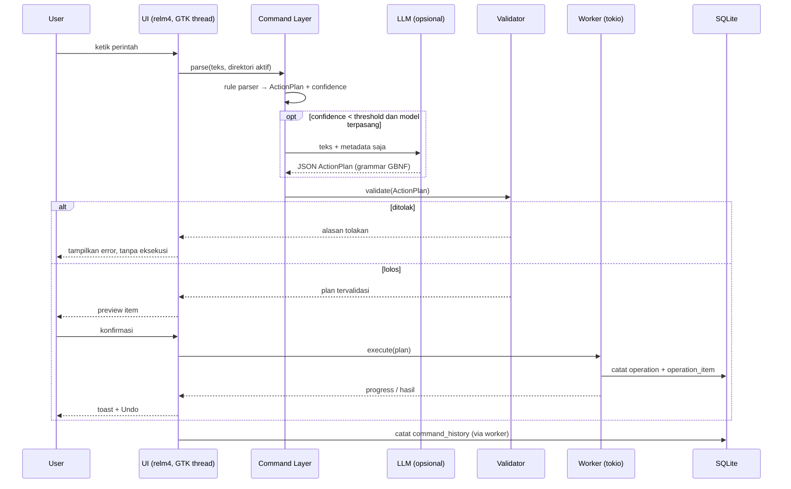
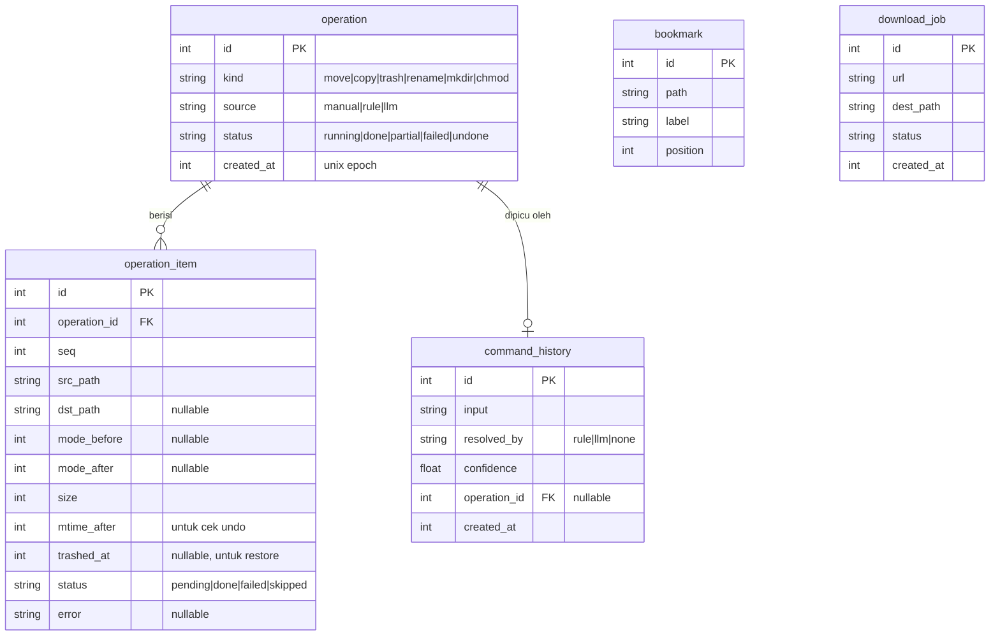

# PRD — Anchoa (Folder Manager Linux)

## 1. Overview

Anchoa adalah file manager desktop Linux (setara Thunar/Nautilus) berbasis GTK4 + libadwaita dengan panel perintah terintegrasi untuk operasi file batch dan bersyarat, misalnya "pindahkan semua `.jpg` yang lebih tua dari 30 hari ke folder arsip". Perintah diproses **rule-first**: parser deterministik menangani sebagian besar kasus, dan model LLM lokal kecil (opsional) hanya dipakai sebagai fallback. Semua rencana aksi divalidasi dan dipreview sebelum dieksekusi. Target pengguna: pengguna Linux yang nyaman dengan keyboard dan sering merapikan file dalam jumlah banyak, tanpa ingin menulis skrip shell atau mengirim data ke cloud.

## 2. Goals & Success Metrics

- **Goal:** operasi file batch/bersyarat bisa dilakukan lewat bahasa perintah sederhana, dengan keamanan setara operasi manual (preview, konfirmasi, undo), tanpa network dan tanpa wajib memasang model.
- **Success looks like:**
  - ≥70% perintah di panel selesai tanpa LLM (`command_history.resolved_by = 'rule'`), diukur dari database lokal saat dogfooding. Tidak ada telemetri.
  - Membuka direktori berisi 10.000 file hingga daftar tampil: <500 ms.
  - Cold start hingga jendela interaktif: <1 s (tanpa model termuat).
  - UI thread tidak pernah terblokir >16 ms (satu frame) selama operasi file atau inferensi LLM berjalan.

## 3. Requirements

- **R1 — Whitelist operasi.** Panel perintah hanya bisa menghasilkan operasi `move`, `copy`, `trash`, `rename`, `mkdir`, `chmod`. Tidak ada jalur eksekusi shell command.
- **R2 — Validator wajib.** Setiap `ActionPlan`, baik dari rule parser maupun LLM, lolos `Validator` sebelum dieksekusi. Tidak ada jalur bypass, termasuk untuk debugging.
- **R3 — Delete lewat trash.** Delete default memindahkan ke trash XDG. Hapus permanen hanya jika diminta eksplisit dan dikonfirmasi lewat dialog.
- **R4 — Model opsional.** Navigasi, CRUD, dan perintah rule-based berfungsi penuh tanpa model terpasang.
- **R5 — Tanpa network.** Tidak ada panggilan jaringan untuk fungsi apa pun, termasuk AI.
- **R6 — State di path XDG.** Konfigurasi di `$XDG_CONFIG_HOME/anchoa/`, data di `$XDG_DATA_HOME/anchoa/`. Tidak ada file lain yang ditulis ke home directory.
- **R7 — Metadata saja ke model.** Prompt LLM hanya berisi nama, ukuran, permission, dan timestamp. Isi file tidak pernah dibaca untuk prompt.
- **R8 — Preview + konfirmasi.** Setiap operasi destruktif (move, trash, rename, chmod, overwrite) menampilkan preview daftar item dan menunggu konfirmasi eksplisit. Tidak ada auto-execute.
- **R9 — Keyboard penuh.** Semua fitur v1 bisa dipakai tanpa mouse, termasuk panel perintah, preview, dan dialog konfirmasi.
- **R10 — Lingkungan.** Berjalan wajar di KDE Plasma dan i3wm: client-side decoration, tetap berfungsi tanpa compositor.
- **R11 — Tanpa state parsial ambigu.** Operasi batch yang gagal di tengah jalan meninggalkan state yang tercatat jelas per item dan tidak menyisakan file parsial (lihat §6.4).

## 4. Core Features

1. **Navigasi & listing direktori**
   - List view virtualized (kolom: nama, ukuran, tipe, permission, waktu modifikasi); sort per kolom; toggle file tersembunyi.
   - Enumerasi direktori berjalan di worker thread; UI menampilkan hasil bertahap.
   - Path bar yang bisa diedit (Ctrl+L), riwayat back/forward (Alt+Left/Right), naik satu level (Alt+Up).
2. **Operasi file manual (CRUD)**
   - Copy, cut/paste (move), rename (F2), buat folder (Ctrl+Shift+N), trash (Delete), hapus permanen (Shift+Delete, dengan dialog konfirmasi).
   - Konflik nama: dialog pilih *skip* / *replace* / *keep both* (sufiks ` (2)`), dengan opsi "terapkan ke semua".
   - Operasi manual juga dicatat ke `operation` sehingga bisa di-undo.
3. **Sidebar**
   - Tempat XDG (Home, Documents, Downloads, Pictures, dll.), drive yang di-mount di `/run/media/$USER` dan `/mnt`, dan bookmark pengguna (tambah Ctrl+D, urutan bisa diubah).
4. **Cari nama**
   - Filter nama di direktori aktif (mulai mengetik) dan cari rekursif by nama/glob (Ctrl+F) yang berjalan di worker dan bisa dibatalkan (Esc). Tidak mencari isi file.
5. **Panel perintah (rule-based)**
   - Grammar bahasa Inggris untuk v1. Contoh:
     - `move *.jpg older than 30d to ~/Pictures/old`
     - `trash *.tmp in ~/Downloads`
     - `copy *.pdf larger than 5mb to ~/Documents/big`
     - `rename *.jpeg to *.jpg`
     - `mkdir 2026-09`
     - `chmod 644 *.txt`
   - Kondisi yang didukung: glob nama, umur (`older/newer than Nd`), ukuran (`larger/smaller than N{kb,mb,gb}`), tipe (`files`/`dirs`).
   - Parser menghasilkan `ActionPlan` + skor confidence. Skor di bawah threshold diteruskan ke LLM fallback (jika model ada).
6. **LLM fallback (opsional)**
   - Aktif hanya jika pengguna sudah memilih file `.gguf` di Settings.
   - Input: teks perintah + metadata direktori aktif (R7). Output dibatasi oleh grammar JSON (GBNF) ke skema `ActionPlan` yang sama dengan parser.
   - Hasil tetap lewat Validator dan preview. Inferensi berjalan di worker dan bisa dibatalkan.
7. **Validator**
   - Menolak: operasi di luar whitelist; path yang setelah kanonikalisasi (termasuk resolusi symlink dan `..`) berada di luar root yang diizinkan (home, `/run/media`, `/mnt`); target yang menimpa file tanpa kebijakan konflik eksplisit; mode `chmod` di luar format oktal 3 digit atau yang menambah bit setuid/setgid/sticky.
   - Pesan tolakan menyebut item dan alasan spesifik.
8. **Preview & eksekusi**
   - Preview: tabel item (sumber → tujuan / mode lama → baru), jumlah item, total ukuran, konflik yang terdeteksi. Konfirmasi dengan Enter, batal dengan Esc.
   - Eksekusi di worker dengan progress dan tombol batal.
9. **Undo multi-level**
   - Ctrl+Z membatalkan operasi terakhir yang belum di-undo, berulang mundur melalui riwayat.
   - Undo hanya dijalankan jika state "after" masih cocok dengan kondisi disk (file ada di path tujuan dengan ukuran & mtime sama). Jika tidak cocok, undo item itu dilewati dan dilaporkan.
   - Kebalikan per operasi: move/rename → pindah balik; copy → trash salinan; mkdir → hapus jika masih kosong; chmod → kembalikan mode lama; trash → restore dari trash.
   - Undo yang menghapus/menimpa sesuatu tetap melewati preview + konfirmasi (R8).
10. **Riwayat & retensi**
    - Panel riwayat menampilkan operasi dan perintah terakhir.
    - Pemangkasan otomatis saat startup: hapus operasi berumur >30 hari **atau** di luar 1.000 operasi terakhir (mana yang lebih dulu tercapai).
11. **Settings**
    - Disimpan di `$XDG_CONFIG_HOME/anchoa/config.toml`: path model `.gguf`, threshold confidence parser, tampilkan file tersembunyi, sort default.
    - Pemilih file model menampilkan link dokumentasi (model yang direkomendasikan + checksum). App tidak mengunduh apa pun.

## 5. Out of Scope

| Item | Alasan |
|------|--------|
| Download manager / torrent (aria2c wrapper) | Ditunda ke v2; skema `download_job` sudah disiapkan agar migration tidak dirombak. |
| Tab & multi-window | Ditunda ke v2; menambah kompleksitas state UI. |
| Dual-pane view | Ditunda ke v2. |
| Operasi remote (SFTP/SMB/MTP/GVfs) | Ditunda ke v2; semantik kegagalan dan undo berbeda dari filesystem lokal. |
| Thumbnail (gambar, video, PDF) | Tidak kritis untuk operasi batch; listing tetap cepat tanpa thumbnailer. |
| Plugin/extension system | Ditunda ke v2; API internal belum stabil. |
| LLM cloud/API backend | Melanggar R5. |
| Perintah bahasa Indonesia | Target v1.x setelah grammar Inggris stabil. |
| Redo | Undo multi-level cukup untuk v1; redo butuh state dua arah. |
| Dialog properti & editor permission GUI | `chmod` tersedia lewat panel perintah; permission tampil sebagai kolom listing. |
| Download model di dalam app | Melanggar R5; pengguna mengunduh `.gguf` sendiri. |

## 6. User Flow

### 6.1 Navigasi keyboard
1. Pengguna membuka Anchoa; fokus di list direktori home.
2. Panah atas/bawah memilih item, Enter membuka folder, Alt+Up naik satu level.
3. Ctrl+L memfokuskan path bar; pengguna mengetik path, Tab melengkapi nama, Enter berpindah.
4. F6 berpindah fokus antar sidebar, list, dan panel perintah.

### 6.2 Perintah rule-based
1. Pengguna menekan Ctrl+K (fokus panel perintah) dan mengetik `move *.jpg older than 30d to ~/Pictures/old`.
2. Rule parser menghasilkan `ActionPlan` dengan confidence ≥ threshold.
3. Worker mengevaluasi kondisi terhadap metadata direktori dan mengisi daftar item.
4. Validator memeriksa plan; lolos.
5. UI menampilkan preview: 42 file, 310 MB, 0 konflik, folder tujuan akan dibuat.
6. Pengguna menekan Enter. Worker mengeksekusi dengan progress.
7. Sistem mencatat `operation`, `operation_item`, dan `command_history (resolved_by = 'rule')`. Toast menampilkan hasil + tombol Undo.

### 6.3 LLM fallback
1. Pengguna mengetik `put my old screenshots somewhere tidy`.
2. Parser menghasilkan confidence di bawah threshold. Model terpasang.
3. Worker memuat model (jika belum) dan mengirim perintah + metadata direktori aktif. UI menampilkan status "memproses" dengan tombol batal.
4. Model menghasilkan JSON `ActionPlan` sesuai grammar.
5. Validator memeriksa plan. Jika ditolak, UI menampilkan alasan dan tidak ada eksekusi.
6. Jika lolos, alur berlanjut seperti §6.2 langkah 5–7, dengan `resolved_by = 'llm'` dan label "dihasilkan AI" di preview.

### 6.4 Kegagalan di tengah batch
1. Worker sedang menyalin 200 file; file ke-120 gagal karena disk penuh (atau permission ditolak).
2. Setiap file disalin ke nama sementara `.anchoa-partial-<nama>` di folder tujuan, lalu di-rename atomik setelah selesai. File sementara yang gagal langsung dihapus, jadi tidak ada file setengah jadi dengan nama asli.
3. Untuk move lintas filesystem, sumber dihapus hanya setelah salinan selesai dan tervalidasi (ukuran sama).
4. Worker berhenti. `operation.status = 'partial'`; tiap `operation_item` berstatus `done`, `failed`, atau `pending`.
5. UI menampilkan ringkasan: 119 berhasil, 1 gagal (dengan pesan error), 80 belum diproses, dan dua pilihan:
   - **Rollback** — batalkan 119 item yang sudah selesai (lewat mekanisme undo, dengan preview).
   - **Pertahankan** — biarkan 119 item; operasi tercatat `partial` dan tetap bisa di-undo nanti.
6. Pembatalan manual oleh pengguna (tombol batal) mengikuti alur yang sama.

### 6.5 Undo
1. Pengguna menekan Ctrl+Z.
2. Sistem mengambil operasi terakhir yang belum di-undo dan memeriksa state "after" setiap item.
3. Preview menampilkan item yang akan dikembalikan dan item yang dilewati (state berubah sejak operasi).
4. Pengguna mengonfirmasi. Worker menjalankan kebalikan operasi; `operation.status = 'undone'`.
5. Ctrl+Z berikutnya melanjutkan ke operasi sebelumnya.

### 6.6 Perintah tidak dikenali, model tidak terpasang
1. Pengguna mengetik perintah yang tidak cocok dengan grammar.
2. Parser menghasilkan confidence di bawah threshold; model tidak terpasang.
3. Panel menampilkan "Perintah tidak dikenali", 3 contoh sintaks terdekat, dan link ke Settings → Model.
4. Tidak ada eksekusi. `command_history.resolved_by = 'none'`.

## 7. Architecture

## 8. Database Schema

Lokasi: `$XDG_DATA_HOME/anchoa/history.db`. Versi migration dilacak lewat `PRAGMA user_version`; migration bernomor dan hanya maju.

| Table | Description |
|-------|-------------|
| **operation** | Satu operasi (manual atau dari perintah) beserta status agregatnya. Unit undo. |
| **operation_item** | Satu file dalam operasi: path sebelum/sesudah, mode sebelum/sesudah, dan data verifikasi untuk undo. Tidak pernah menyimpan isi file. |
| **command_history** | Setiap perintah di panel: teks, cara diselesaikan (rule/llm/none), confidence, dan operasi yang dihasilkan. Dipakai untuk metrik §2. |
| **bookmark** | Bookmark sidebar pengguna dengan urutan tampil. |
| **download_job** | Placeholder v2. Tabel dibuat di migration, tanpa kode yang memakainya. |

## 9. Design & Technical Constraints

- **Bahasa & UI:** Rust edition 2024; `gtk4-rs` + libadwaita; komponen lewat `relm4`. Intent: UI native GNOME/GTK yang tetap wajar di KDE dan tiling WM.
- **Konkurensi:** satu proses; UI thread tidak pernah melakukan I/O file atau inferensi. Semua lewat channel async ke worker (tokio). Tidak mencampur runtime async.
- **Persistensi:** SQLite via `rusqlite` dari worker thread; preferensi di TOML terpisah.
- **LLM:** `llama.cpp` via crate `llama-cpp-2`. Model yang didukung: Qwen2.5-1.5B/3B-Instruct Q4_K_M. Model 7B+ tidak didukung (target: laptop tanpa GPU diskrit). `unsafe` FFI diisolasi dan dibungkus API aman.
- **Path & trash:** direktori XDG diambil lewat `glib::user_config_dir()` / `glib::user_data_dir()`, tidak di-hardcode. Trash lewat `gio::File::trash()` (menangani `.Trash-$uid` di mount lain dan portal Flatpak).
- **Packaging:** AUR (PKGBUILD) dan Flatpak dengan `--filesystem=home`, `--filesystem=/run/media`, `--filesystem=/mnt`. Tidak memakai `--filesystem=host`, tidak ada izin network.
- **Identitas:** nama `anchoa`, app ID `io.github.syharipf.Anchoa`.
- **Lisensi:** GPL-3.0-or-later.
- **Kualitas:** `cargo fmt`, `cargo clippy --all-targets -- -D warnings`, dan test wajib untuk parser, Validator (termasuk input adversarial), dan skenario gagal filesystem di temp dir.

## 10. Assumptions & Open Questions

- **Assumptions made:**
  - Target pengguna: pengguna Linux power user, satu user per sesi, tanpa kebutuhan multi-user.
  - Contoh grammar di §4.5 dan target performa di §2 adalah usulan awal, bukan hasil pengukuran.
- **Open questions:**
  - Threshold confidence parser: usulan awal 0.8, dituning dari data `command_history` saat dogfooding.
  - Spesifikasi grammar parser lengkap (kombinasi kondisi, `and`/`or`, kuotasi nama berspasi).
  - Restore dari trash untuk undo di dalam sandbox Flatpak: perlu dicek apakah akses ke `trash:///` (gvfs) tersedia tanpa izin tambahan. Jika tidak, undo trash di Flatpak perlu fallback (misalnya arahkan pengguna ke trash sistem).
  - Apakah dialog properti / editor permission GUI masuk v1.x.
